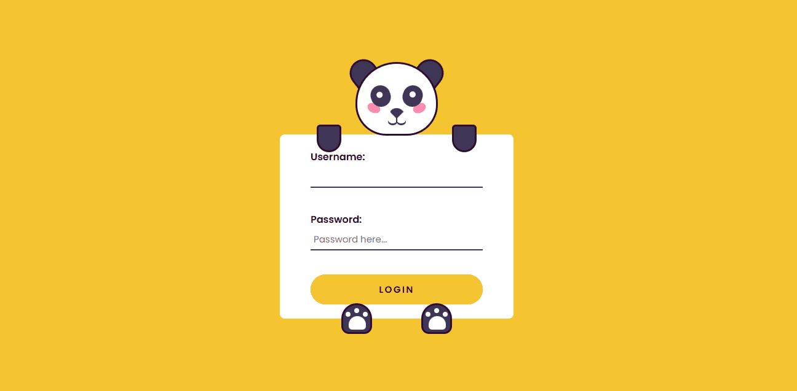

# Formulario Panda 🐼🎍

Formulario Panda é uma aplicação web, desenvolvida com intuito de treinar meus conhecimentos em HTML, CSS e JavaScript.
O projeto oferece uma interface intuitiva, ao clicar no campo do nome do usuario o panda olha para o local onde esta sendo digitado.
Ao clicar no local de senha o panda tapa os olho de maneira comica, ao enviar o formulario o panda voltará ao normal.
## Visão geral

### Captura do projeto

[]

### Links

- URL do site ativo: [🛜Projeto ativo aqui💻](https://tales-santos7.github.io/formularioPanda/)
- Inspirado no projeto do canal code_wars_official (https://www.instagram.com/p/C_p8H8cgl6M/?igsh=ZjFkYzMzMDQzZg==)

## Sobre esse Projeto 

Creditos "https://www.instagram.com/p/C_p8H8cgl6M/?igsh=ZjFkYzMzMDQzZg=="

📱 Responsivo: Otimizado para desktop e dispositivos móveis. 

### Construído com

 
- HTML5  
  - CSS   
- JavaScript

### O que eu aprendi

Trabalhar nesse projeto me ajudou a compreender melhor alguns conceitos em que antes eu tinha dificuldade. 

Ao me envolver diretamente com esse projeto prático, eu tive a oportunidade de aplicar na prática conceitos como HTML, CSS, e JavaScript que são a base do desenvolvimento web. Isso me permitiu entender de forma mais profunda como esses elementos se integram para criar interfaces ricas e interativas.

Além disso, eu precisei lidar com desafios de designr e esponsividade, que são aspectos cruciais no desenvolvimento front-end moderno. Ao enfrentar esses desafios, pude aprimorar minhas habilidades de resolução de problemas, pensamento crítico e tomada de decisões.

## Outros

### Minhas redes sociais!

 
   
  
   
   

